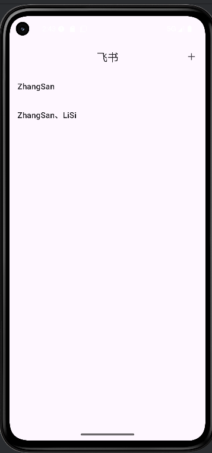
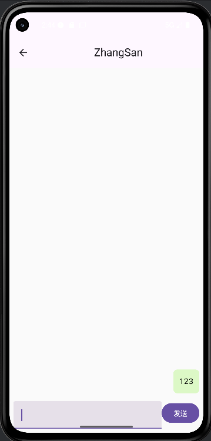
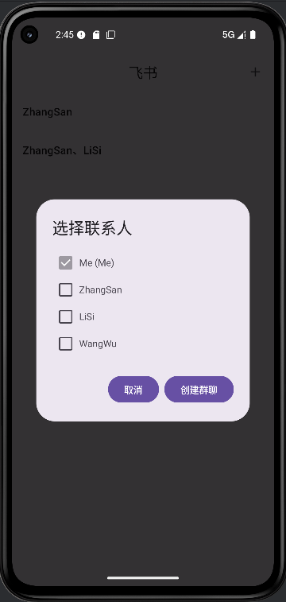

# FlyBook 聊天应用
## 已实现功能

1. **会话管理**

    * 支持显示会话列表。
    * 点击会话进入聊天页面查看消息。
    * 会话信息包括名称和成员列表。
    * 注：后续要添加显示最新消息及未读消息数的功能


2. **聊天功能**

    * 支持发送文本消息。
    * 消息列表实时刷新，自己发送的消息靠右显示，绿色背景，其他消息靠左显示，白色背景。(接收其他人信息还未实现)
    * 消息按时间排序显示，支持加载历史消息。



3. **联系人与群聊**

    * 支持选择联系人创建 1 对 1 聊天或群聊。
    * 群聊创建支持自定义群名。
    * 创建会话后自动跳转至聊天页面。
    * 当前用户在选择联系人列表中默认选中，防止自己被漏选。
    * 若选择的联系人（1 对 1或者群聊）有过聊天记录，可复用（可以看见之前的聊天记录）。


4. **数据库支持**

    * 使用 Room 持久化存储会话、消息和会话成员信息。
    * 支持查询历史消息和会话列表。
    * 数据库表包括：

        * `conversations`：会话表
        * `messages`：消息表
        * `conversation_members`：会话成员表

## 后续应该进行“离线消息补发 + 群聊创建立即生效”的修改：

### 1. 数据层（`database`）

* **目的**：确保消息和系统通知都持久化，以便离线用户上线后可以拉取。
* **相关文件**：

   * `MessageEntity.kt`

      * 已经支持 `conversationId` 外键和消息存储，可以直接保存离线消息。
   * `ChatDao.kt`

      * 需要增加方法：

         * `getUnreadMessagesForUser(userId: Long)`：拉取用户未读消息。
         * 如果已有 `getConversation(conversationId)`，可保证上线后拉取历史消息。

**修改建议**：

```kotlin
@Query("SELECT * FROM messages WHERE conversationId = :conversationId AND timestamp > :lastReadTime ORDER BY timestamp ASC")
fun getUnreadMessages(conversationId: Long, lastReadTime: Long): List<MessageEntity>
```

* 记录每个用户的最后阅读时间，可以新增 `UserConversationState` 表存储。

---

### 2.ViewModel 层（`viewmodel`）

* **目的**：管理消息状态和离线消息拉取逻辑。
* **相关文件**：

   * `ChatViewModel.kt`

      * **新增逻辑**：

         * 当用户上线时，调用 `loadMessages(conversationId)` 获取历史消息（已实现）。
         * 可增加方法 `loadUnreadMessages(userId: Long)` 拉取离线未读消息。
   * `HomeViewModel.kt`

      * **新增逻辑**：

         * 创建群聊成功后，不管成员是否在线，都保存消息到数据库。
         * 用 `_createdConversationId` 通知 UI 跳转。

---

### 3. 网络 / 通信逻辑

* **目的**：模拟 WebSocket 收到消息。
* **相关文件**：

   * 你的前端代码没有专门的 `WebSocketManager` 文件，但你提到用工具模拟 WebSocket。
   * 如果以后做真实在线推送：

      * 新增 WebSocket 客户端管理类（如 `WebSocketClient.kt`）。
      * 当用户上线时，向服务器注册 userId。
      * 服务器发送离线消息。
* **前端 ChatScreen 或 ChatViewModel**：

   * 接收 WebSocket 推送后，更新 `_messages`。
   * 如果有离线消息，需要在 `loadMessages(conversationId)` 中统一拉取，保证消息顺序。

---

### 4️. UI 层（`ui/home` + `ui/chat`）

* **目的**：显示离线消息和未读消息。
* **相关文件**：

   * `HomeScreen.kt`：

      * `conversations` 列表需要显示 `unreadCount`。
      * 当用户上线或刷新时，从 ViewModel 拉取最新未读消息。
   * `ChatScreen.kt`：

      * 初始化时加载历史消息。
      * WebSocket 推送来的消息要追加到消息列表。

