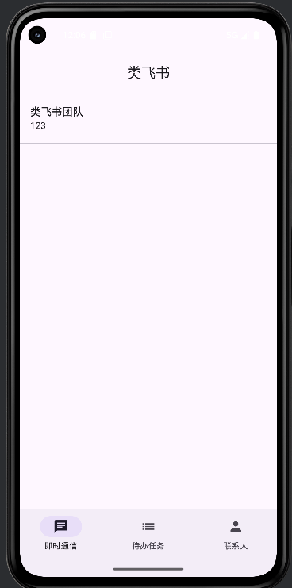
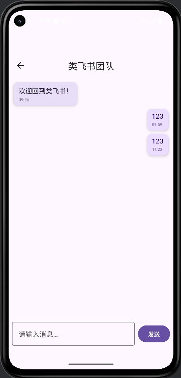
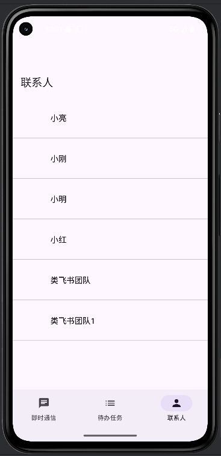

# LeiFeiShu 即时通信模块

# 已实现
- 会话列表（Conversation List）
- 聊天窗口 UI（ChatScreen）
- Navigation 路由跳转
- Room 基础数据结构（MessageEntity / ConversationEntity）
- Koin 依赖注入
- 消息展示气泡样式
- 输入框 UI

## 界面截图

### 会话列表

### 聊天页面

### 联系人
