# FlyBook

#### 第一次提交
#### 即时通信模块：
#### ✅已完成

- 实时消息推送

#### 📄待完成

- 离线消息同步

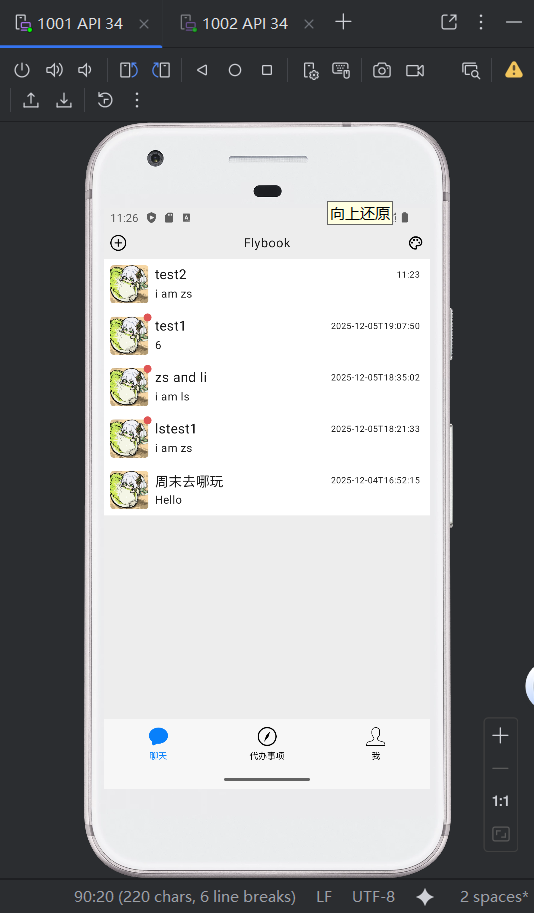
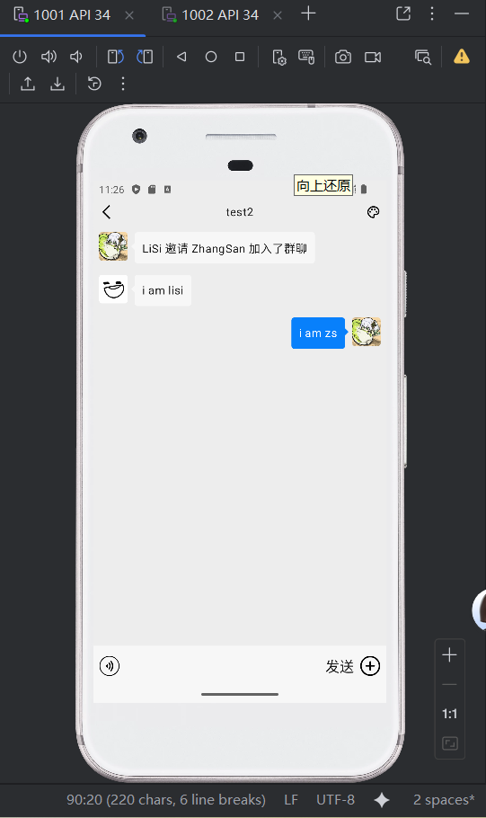
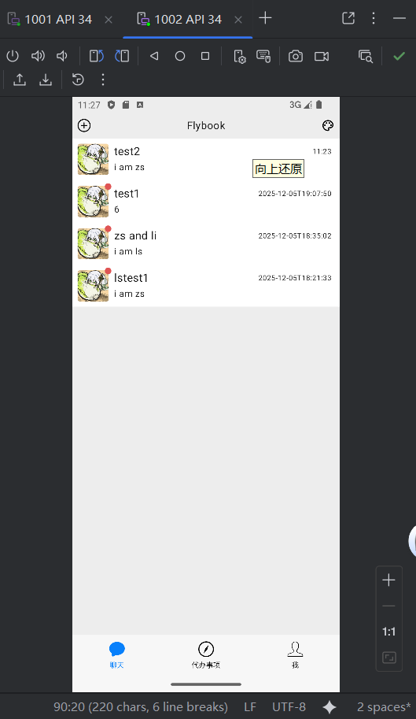
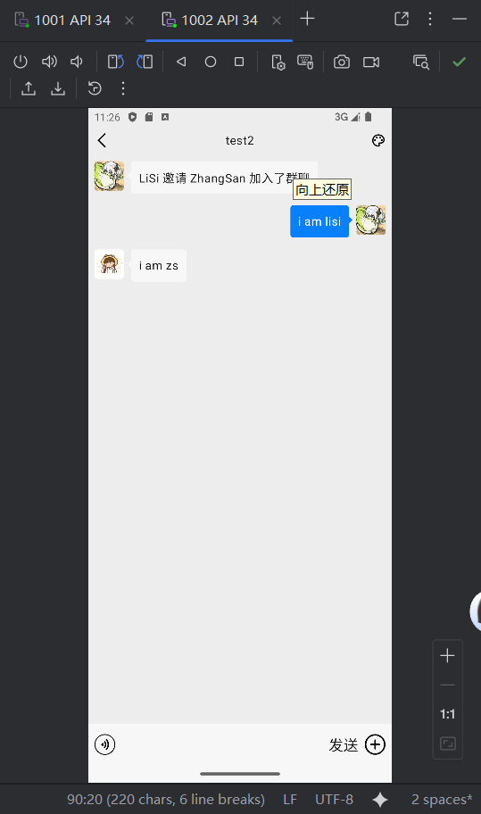

#### 第二次提交
#### 即时通信模块：
#### ✅已完成

- 实时消息推送
- 离线消息同步

场景描述：1001(zhangsan)上线，选择1002(lisi)进入群聊，
系统提示“Zhangsan邀请Lisi加入了群聊”，1001连续发送“1”，“2”，“3”三条信息，
此时1002(lisi)上线，可以看见出现了这个新的聊天框，进入聊天详情页面后可以
看到“Zhangsan邀请Lisi加入了群聊”，“1”，“2”，“3”四条信息，
随后1002发送了“4”这条消息，两人可进行实时聊天；
此时令1001(Zhangsan)下线，1002连续发送“5”，“6”，“7”三条信息，
1001(Zhangsan)重新上线后，可以看到“Zhangsan邀请Lisi加入了群聊”和“1”-“7”八条消息。  
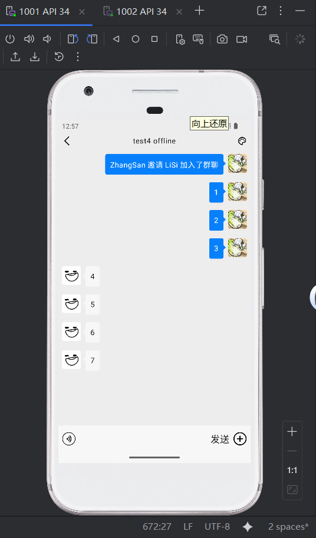
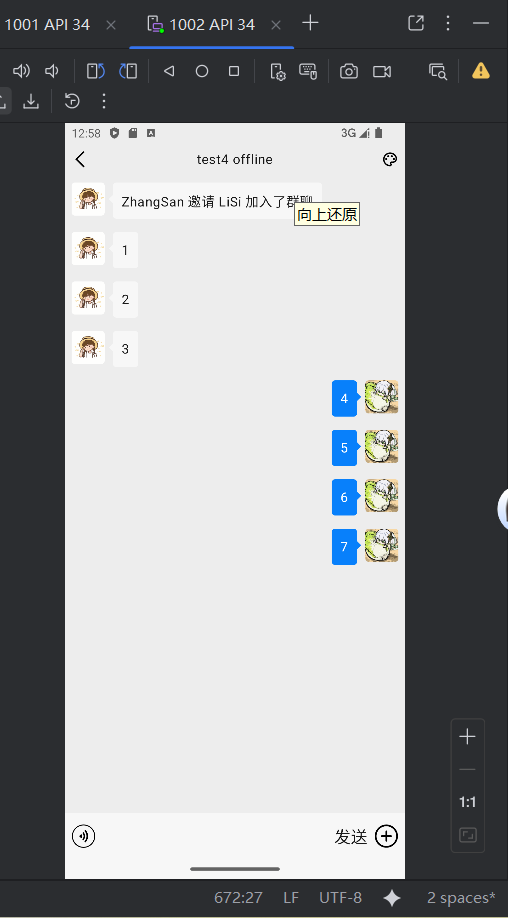

#### 第三次提交  
合并main到HomePage_InstantMessaging

#### 第四次提交
实现跨模块分享功能：
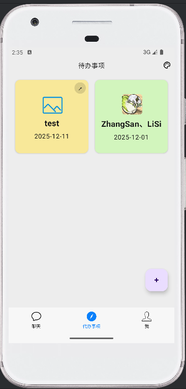
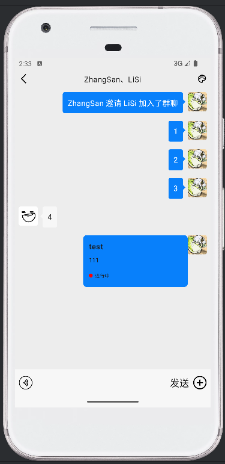
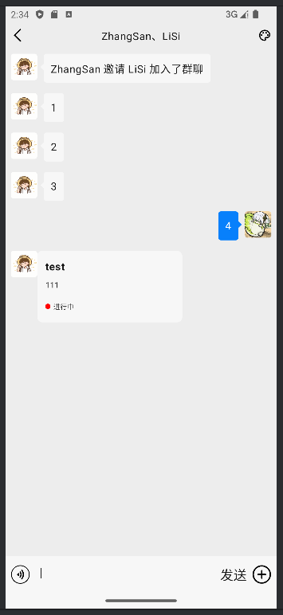

#### 第五次提交
实现发送图片功能：
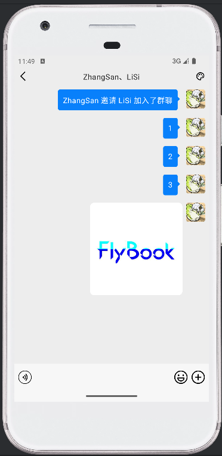
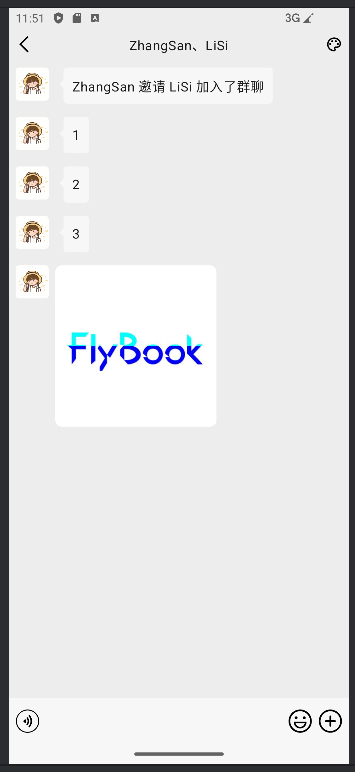
注：当前的图片只能存在手机里，在电脑中直接拖拽到虚拟设备中